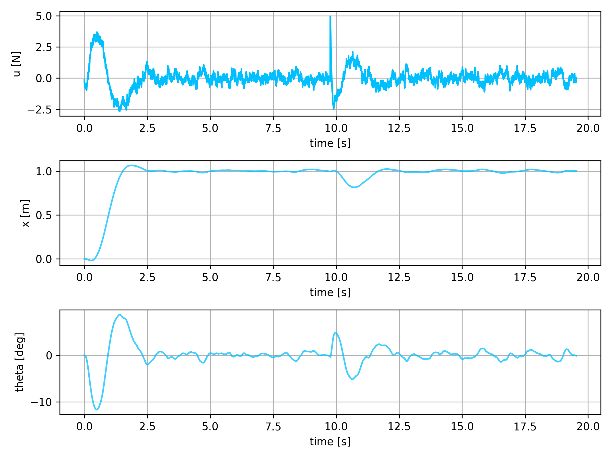
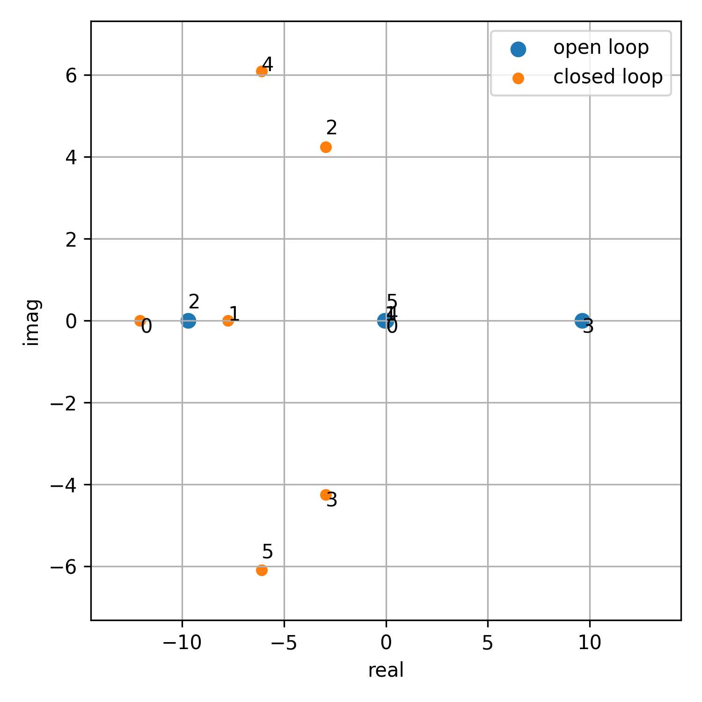
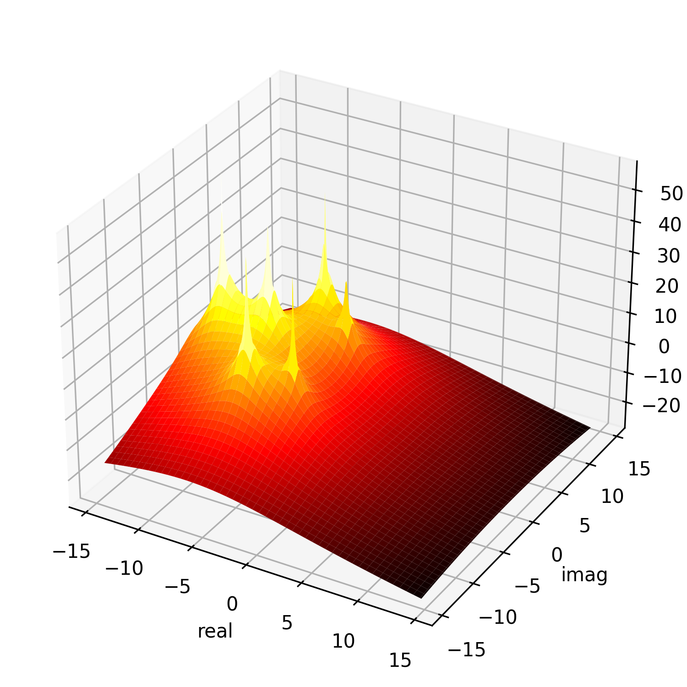
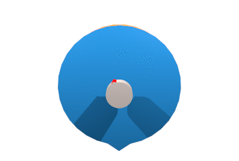
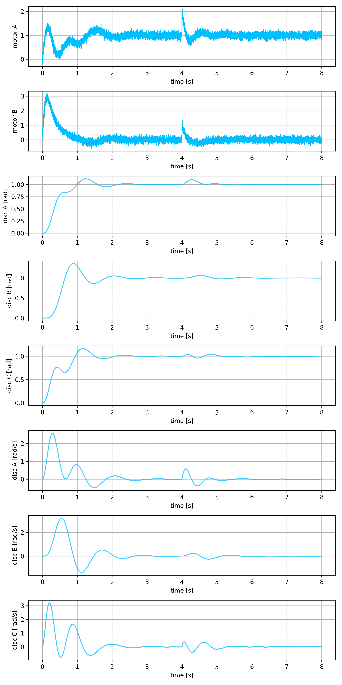
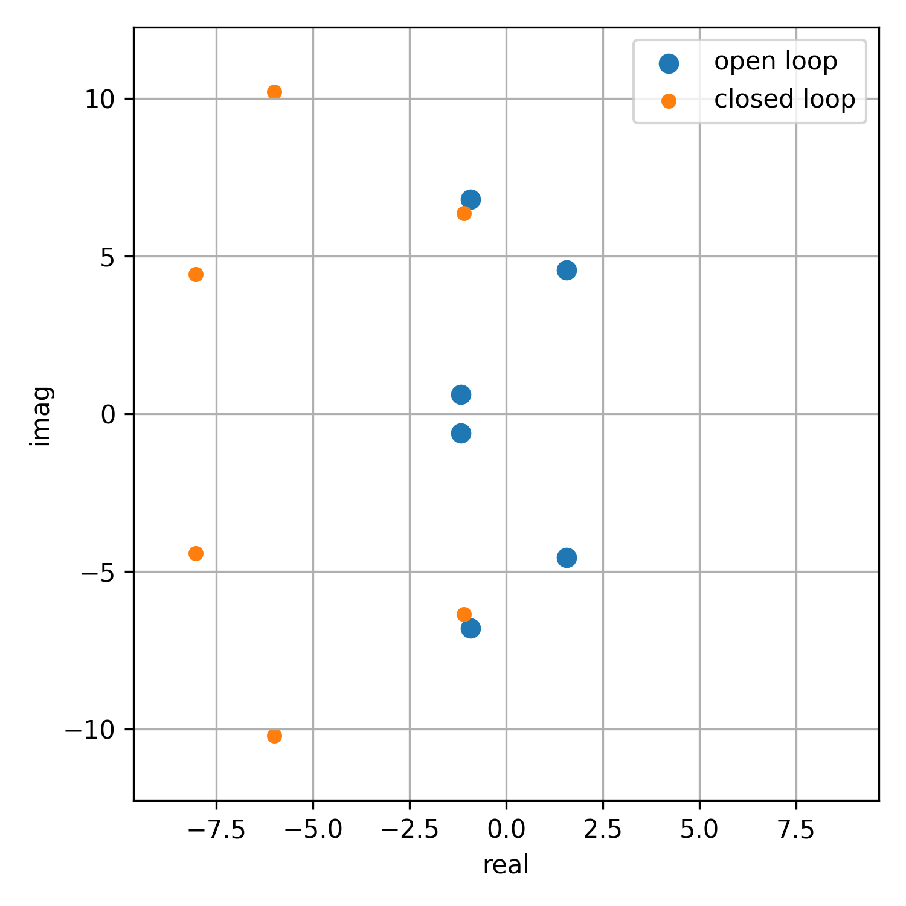
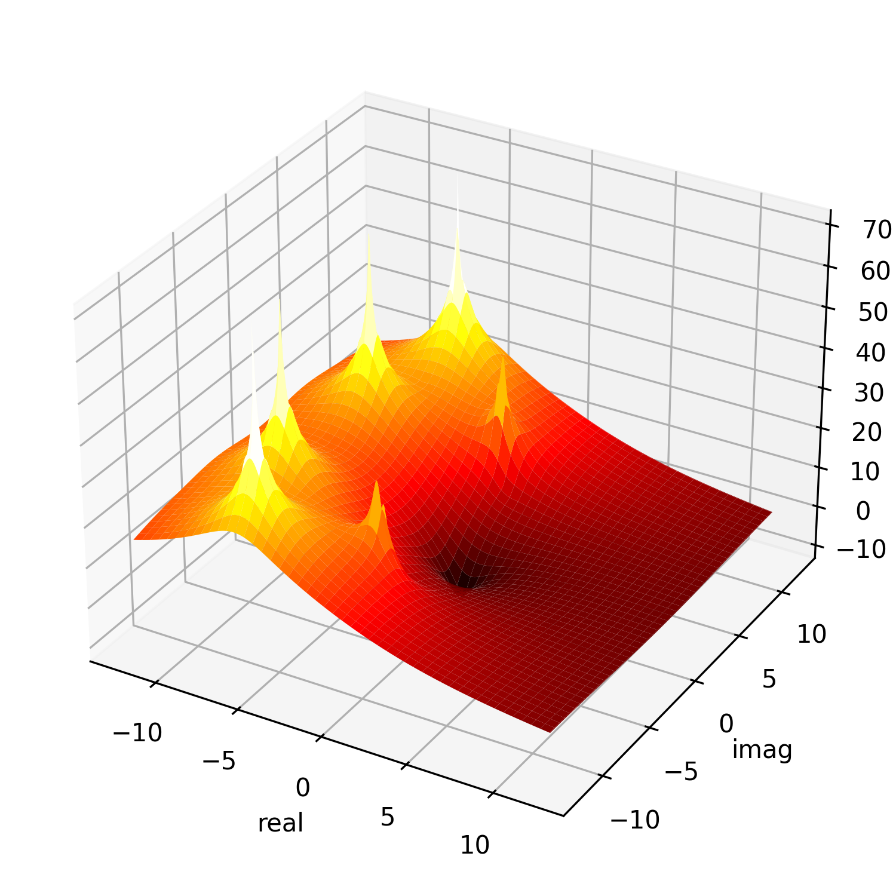
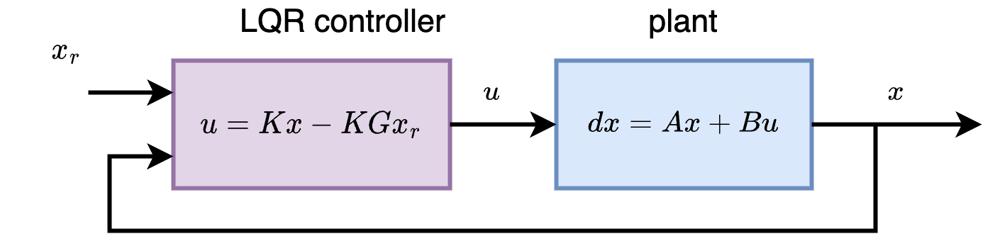
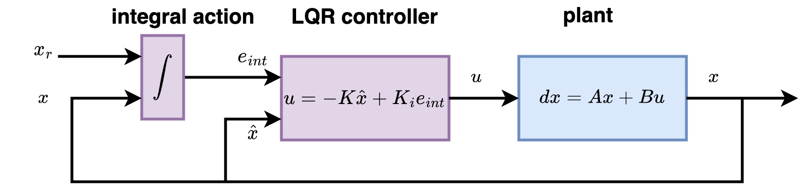
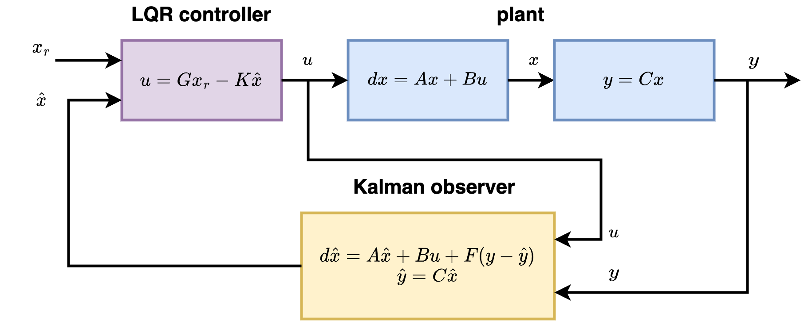

# libs_control

# TODO 
- embedded LibsControlEmbedded
- working live aplication in : [brushless motor control](https://github.com/michalnand/brushless_motor_control)

# [balancing robot](examples/07_balancing_robot/)

- classical inverted pendulum problem
- goal is to control angle and position

 

# [spring wheels](examples/06_lqri_wheels/)

- this great challenging test is taken from 
[www.do-mpc.com](https://www.do-mpc.com/en/latest/getting_started.html#Example-system)
- goal is to control position of wheels

 

# LQR controller

# LQR with integral action controller

- completly removes any constant disturbance

# LQG controller

- dont require observing fully state

