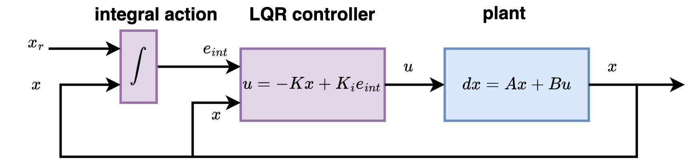
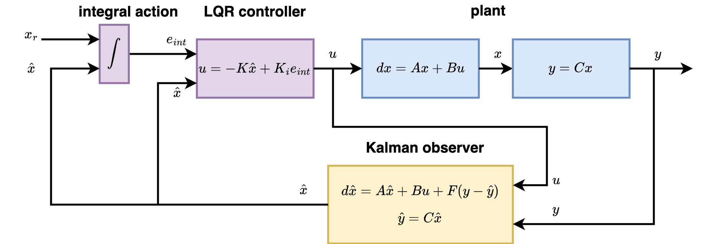

# libs_control

- linear controllers from scratch
- based on solving Riccati equation
- LQR, LQR+integral action, LQG+integral action

# [servo control](examples/02_lqri_motor/)

- 3rd order servo control
- live example with code for stm32f0 [brushless motor control](https://github.com/michalnand/brushless_motor_control)

 

# [balancing robot](examples/07_balancing_robot/)

- classical inverted pendulum problem
- goal is to control angle and position

 

# [spring wheels](examples/06_lqri_wheels/)

- this great challenging test is taken from 
[www.do-mpc.com](https://www.do-mpc.com/en/latest/getting_started.html#Example-system)
- goal is to control position of wheels

 

# LQR controller

basic minimal tutorial for 2nd order servo : 
[01_lqr_servo.ipynb](tutorials/01_lqr_servo.ipynb)

# LQR with integral action controller

- completly removes any constant disturbance

basic minimal tutorial for 2nd order servo : 
[02_lqr_integral_action_servo.ipynb](tutorials/02_lqr_integral_action_servo.ipynb)

# LQG controller

- dont require observing fully state
- uses Kalman filter to estimate x, from y, and u, and also provides denoising

basic minimal tutorial for 2nd order servo : 
[03_lqg_servo.ipynb](tutorials/03_lqg_servo.ipynb)

# sparse model identification

[04_sparse_model_identification.ipynb](tutorials/04_sparse_model_identification.ipynb)

# TODO 
- embedded LibsControlEmbedded - not done
- working live aplication : [brushless motor control](https://github.com/michalnand/brushless_motor_control)

- MPC
